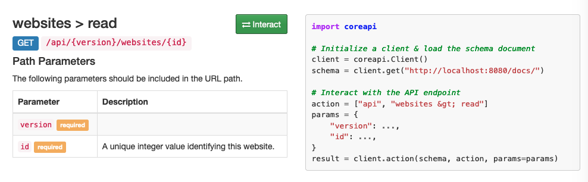

Setup for the whole seosnap stack including dashboard, cache server and cache warmer used for prerendering and full page
caching PWA's.

Original version at: https://github.com/experius/SeoSnap

This repo illustrates how you can install and run __SeoSnap__
at [this commit](https://github.com/experius/SeoSnap/tree/6c80a2123f2757ea60e60564d8fd1798eac649d5), with and without
docker.

# Work with docker-compose

## Installation

Requirement:

* make (if you install with code)
* docker, docker-compose

### With code:

#### Step 1: Get code

    git clone --recursive https://github.com/experius/SeoSnap.git
    cd SeoSnap
    git checkout 6c80a2123f2757ea60e60564d8fd1798eac649d5

#### Step 2: Fix code

* Go to __seosnap-dashboard/dev/commands/install.sh__, change content of the file to:

        #!/bin/sh
        if [ -f ".env" ]; then
        echo 'Generating new secret key'
        # export NEW_SECRET="$(cat /dev/urandom | tr -dc 'a-zA-Z0-9' | head -c50)";
        export NEW_SECRET="$(head /dev/urandom | base64 | tr -dc 'a-zA-Z0-9' | head -c60)";
        
        sed -i.bak "s/https\:\/\/miniwebtool.com\/django-secret-key-generator\//${NEW_SECRET}/g" .env;
        
        echo 'Setting new admin user login'
        read -p 'Username [snaptron]: ' ADMIN_NAME
        read -p 'Email [snaptron@snap.tron]: ' ADMIN_EMAIL
        read -sp 'Password [Sn@ptron1337]: ' ADMIN_PASS
        sed -i.bak "s/snaptron$/${ADMIN_NAME:-snaptron}/g" .env;
        sed -i.bak "s/snaptron@snap.tron/${ADMIN_EMAIL:-snaptron@snap.tron}/g" .env;
        sed -i.bak "s/Sn@ptron1337/${ADMIN_PASS:-Sn@ptron1337}/g" .env;
        fi

* At root folder, run: `make install`

#### Step 3: Run

* At root folder, run: `make up`

### Built version

#### Step 1: Get code

* Download [this](https://github.com/experius/SeoSnap/releases/download/latest/release.zip).
* Extract it
* `cd release`

#### Step 2: Fix code

* Change content of __install.sh__ to:

        #!/bin/sh
        if [ -f ".env" ]; then
        echo 'Generating new secret key'
        # export NEW_SECRET="$(cat /dev/urandom | tr -dc 'a-zA-Z0-9' | head -c50)";
        export NEW_SECRET="$(head /dev/urandom | base64 | tr -dc 'a-zA-Z0-9' | head -c60)";
        
        sed -i.bak "s/https\:\/\/miniwebtool.com\/django-secret-key-generator\//${NEW_SECRET}/g" .env;
        
        echo 'Setting new admin user login'
        read -p 'Username [snaptron]: ' ADMIN_NAME
        read -p 'Email [snaptron@snap.tron]: ' ADMIN_EMAIL
        read -sp 'Password [Sn@ptron1337]: ' ADMIN_PASS
        sed -i.bak "s/snaptron$/${ADMIN_NAME:-snaptron}/g" .env;
        sed -i.bak "s/snaptron@snap.tron/${ADMIN_EMAIL:-snaptron@snap.tron}/g" .env;
        sed -i.bak "s/Sn@ptron1337/${ADMIN_PASS:-Sn@ptron1337}/g" .env;
        fi

#### Step 3: Run

      chmod u+x install.sh
      ./install.sh
      docker-compose up

## How to set up

#### Step 1: set up a page

* Visit dashboard at __localhost:80__, you will see if the project is installed successfully

* Enter username and password to login. If you don't remember, see __ADMIN_NAME__ and __ADMIN_PASS__ in `.env` file

* Dashboard looks as below. Try adding a page by press __add__ in __Website__.

* Fill:
    * __name__ with a name.
    * __domain__ with your site's domain (ex: google.com).
    * __sitemap__ with your page's [sitemap](https://developers.google.com/search/docs/advanced/sitemaps/overview). This
      is usually stored at _your_domain_/sitemap.xml (
      ex: [https://www.google.com/sitemap.xml](https://www.google.com/sitemap.xml))

* Save your settings.

* Try visiting __localhost:5000/render/_your_domain___ to see the site.

#### Step 2: crawl (indexing the domain in cache)

* To crawl a website, you need to know its ID. Usually, the id increments from 1 (ex: if https://www.google.com is the
  first website that you add, it will have id 1. The next website has id 2. If you delete a website, its it still
  exists). Therefore, if you haven't delete any website, or have a small amount of websites, you can count it manually.

* If you can't find the id this way, try getting the id from the database:
    * Exec into database container: `docker exec -it seosnap_stack_db /bin/bash`
    * Get id from
      database: `mysql --user snaptron_db --host db --database seosnap_dashboard -e "SELECT id from seosnap_website where name = 'your_website_name'";' --password`
      . Your default password is snaptron_db

* To test if your id is correct:
    * go to http://localhost/docs/

    * In __website > read__, press `Interact`

    * fill version: v1 , id with your page id. Press __Send Request__ to see if you guessed correctly.

* Crawl your website:
    * `docker-compose run cachewarmer cache your_website_id`. Might take some time if the site is big.
    * Other options to crawl with: https://github.com/experius/SeoSnap-Cache-Warmer#commands

* Visit __http://localhost/seosnap/website/your_website_id/pages/__ to see the result.

## Note

* Most setting can be changed at __.env__ and __docker-compose.yml__ file(s)

* This project uses common port dashboard:80 and db:3306. If you have conflict, change it in __docker-compose.yml__
  file:

    * For built installation: In __docker-compose.yml__, line __169__, change `published: 80` to another port (
      ex: `published: 8080`), same for line __228__.

    * For code installation:  In __seosnap-dashboard/docker-compose.yml__, line __42__, change `"3306:3306"` to another
      port (ex: `8081:3306`).

    * If you change port of dashboard, login and docs page changes accordingly

* Because all components are already connected with an underlying network, you can remove expose port of mysql.

# Run on machine

## Installation

Requirement:

* make
* pip3, python >=3.6
* [rendertron](https://github.com/GoogleChrome/rendertron) on port 3000

#### Step 1: get this repo

      git clone https://github.com/alitonia/SeoSnap.git

#### Step 2: Fix code

* Go to __seosnap-dashboard/dev/commands/install.sh__, change content of the file to:

        #!/bin/sh
        if [ -f ".env" ]; then
        echo 'Generating new secret key'
        # export NEW_SECRET="$(cat /dev/urandom | tr -dc 'a-zA-Z0-9' | head -c50)";
        export NEW_SECRET="$(head /dev/urandom | base64 | tr -dc 'a-zA-Z0-9' | head -c60)";
        
        sed -i.bak "s/https\:\/\/miniwebtool.com\/django-secret-key-generator\//${NEW_SECRET}/g" .env;
        
        echo 'Setting new admin user login'
        read -p 'Username [snaptron]: ' ADMIN_NAME
        read -p 'Email [snaptron@snap.tron]: ' ADMIN_EMAIL
        read -sp 'Password [Sn@ptron1337]: ' ADMIN_PASS
        sed -i.bak "s/snaptron$/${ADMIN_NAME:-snaptron}/g" .env;
        sed -i.bak "s/snaptron@snap.tron/${ADMIN_EMAIL:-snaptron@snap.tron}/g" .env;
        sed -i.bak "s/Sn@ptron1337/${ADMIN_PASS:-Sn@ptron1337}/g" .env;
        fi

* At root folder, run: `make install`

#### Step 3: Set-up mysql

* Have 1 instant of mysql on port 3306
* Create user for seosnap:

      # replace newuser and password with DB_USER and DB_PASS in .env
      CREATE USER 'newuser'@'localhost' IDENTIFIED BY 'password';

* Create database:

      # replace db_name with DB_NAME in .env
      CREATE DATABASE db_name

* Grant privilege:

      # replace database_name, username with DB_NAME, DB_USER in .env
      GRANT ALL PRIVILEGES ON database_name.* TO 'username'@'localhost';
      FLUSH PRIVILEGES;

#### Step 4: Run

* Run dashboard:
    * install mysql-client: https://pypi.org/project/mysqlclient/

          brew install mysql-client 
          echo 'export PATH="/usr/local/opt/mysql-client/bin:$PATH"' >> ~/.zshrc

    * Run

          chmod u+x running.sh 
          ./running.sh

* Run cache-server:

        chmod u+x running.sh 
        ./running.sh

* Setup cache-warmer

        chmod u+x setup.sh 
        ./setup.sh

## How to set up

* Setup this installation is almost the same as with docker-compose. This version has dashboard on port 8080.
* You can crawl with docker-compose, or use cd seosnap-cachewarmer && python3 crawl.py cache _website_id_.
